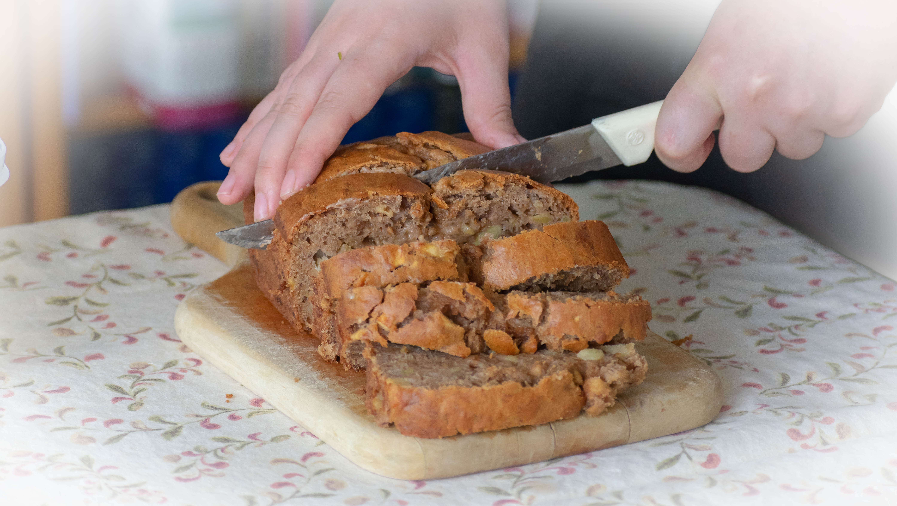

[Original](./banana_bread_matt.html)

## Prework:
Preheat oven to 325
Lightly grease 9x5 loaf pan

## In a large bowl mix:
* 2 cups flour
* 1 tsp baking soda
* ½ tsp baking powder
* ½ tsp salt
* 1 T cinnamon

## In a separate bowl mix:
* 1½ cup mashed overripe bananas (3-4)
* 1/3 cup sugar
* ¾ cup vegetable oil
* 2 eggs
* 1 T vanilla
* Optionally some other fruit (e.g. 1-2 apples) cut small

## Put it all together:
1. Stir banana mixture into flour mixture; stir just to moisten.
2. Pour batter into prepared loaf pan.
3. Bake in preheated oven for 60-70 minutes, until a toothpick inserted into
center of the loaf comes out clean.
4. Let bread cool in pan for 10 minutes, and then turn out onto a wire rack.

## Pictures

