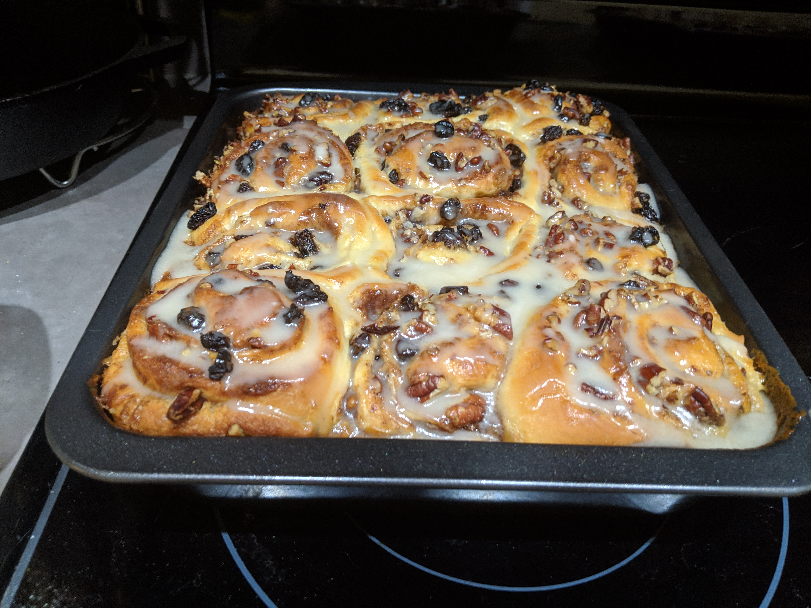

# Cinnamon Rolls

[Original](https://www.twopeasandtheirpod.com/wprm_print/42397){:target="_blank"}

## Ingredients

### Cinnamon Rolls

* 4 1/2 teaspoons active dry yeast (2 packets)
* 1 cup lukewarm water
* 1 teaspoon granulated sugar, to proof the yeast
* 6 tablespoons shortening or unsalted butter
* 1 cup granulated sugar
* 9 cups unbleached all-purpose flour (more if the dough is sticky, up to 10 cups)
* 2 cups hot water
* 2 large eggs, beaten
* 1 tablespoon salt
* 1/2 cup softened butter, divided
* 1 1/2 cups brown sugar, divided
* 1 cup raisins
* 1 cup pecans
* 2 tablespoons ground cinnamon, divided
* 1 cup heavy cream

### Frosting

* 1/4 cup unsalted butter, softened
* 4 cups powdered sugar
* 4 tablespoons milk, more if necessary
* 1 teaspoon vanilla extract

## Instructions

1. In a small bowl, combine the yeast and a pinch of the granulated sugar with the lukewarm water and set aside for 5 minutes or until the yeast bubbles up. It will smell “yeasty.”

2. In the bowl of a stand mixer, add shortening or butter, sugar, and salt to the 2 cups of hot water and beat for 30 seconds, using the beater blade. Let cool to lukewarm temperature. Stir in 2 cups of flour and mix until smooth. Add yeast mixture and mix until well combined. Mix in the beaten eggs.

3. Gradually stir in the remaining flour and mix with the dough hook for about 2 minutes. Remove dough from the bowl and place on a lightly floured counter. Knead by hand, add a little flour if the dough is still sticky. Knead until dough feels satiny and smooth.

4. Cover and let rise for 30 minutes. After the dough has doubled in size, remove it from the bowl and divide it in half. With a rolling pin, roll one half of the dough into a rectangular shape, about 22 X 13 inches. Spread dough evenly with half of the softened butter, about 1/4 cup. Sprinkle dough with half of the brown sugar, raisins, pecans, and cinnamon.

5. Roll up dough into one long roll. Cut rolls, using a piece of dental floss or thread, about two inches thick. Place rolls in greased 9X13-inch baking pans, leaving about 2-inches between the rolls so they have room to rise. Now follow the exact same steps with the other half of the dough.

6. Cover the pans with a clean kitchen towel. Let the rolls rise until double in bulk. Brush with heavy cream. Preheat oven to 350 degrees F. Bake for 20-30 minutes or until cinnamon rolls are golden brown on top and cooked in the middle. Every oven is different so check at 20 minutes to be safe, but it might take longer. You don't want them to be doughy in the middle. Time will also vary based on how big they get during the second rise. Ours take closer to 28-30 minutes. Remove from the oven and let the rolls cool to room temperature.

7. While the rolls are cooling, make the frosting. In a medium bowl, whisk together butter, sugar, milk, and vanilla. Frost the cooled cinnamon rolls generously!

## Pictures

