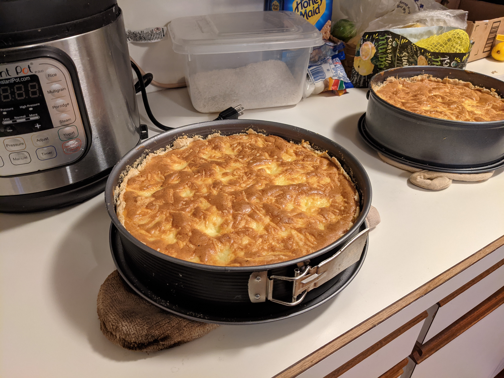

# Notes

* Designed to feed 4 people
* This is designed for a pan that is not the American standard. For an American pan use only 3/4 of the ingredients below
* Gouda or Beemster Vlaskaas Cow's Milk Cheese can be used as a substitute for Edamer

# Ingredients

* 200g (2.013c) flour
* 100g (6.972 Tbsp) butter
* 1/2 tsp salt
* 5 Tbsp water
* Butter to grease a springform pan
* 200g (7.055 oz) cooked ham
* 4 eggs
* 1/3L (1.057c) heavy whipping cream
* 1/2 tsp white pepper
* 1/2 tsp salt
* 125g (4.409 oz) grated Edamer cheese (can use more if necessary)

# Instructions

1. Preheat oven to 200 C (392 F)
1. Put flour and salt in a bowl
1. Slice butter and add it to the bowl
1. Use a pastry cutter to cut butter into flour until you don't have any chunks of butter
1. Add water and stir until the mixture is a uniform color that does not look like flour. The mixture will be crumbly
1. Smear a springform pan with butter and dust with a bit of flour.
1. Press the dough into the pan, making sure that there is a raised crust.
1. Cut the ham into small pieces and sprinkle it onto the dough.
1. Mix the egg yolks with the cream, the pepper, and the salt, then add the cheese.
1. Beat the egg whites until stiff and then fold into the cream mixture.
1. Pour this mixture over the ham.
1. Bake for at least 30 minutes, most likely it will take about 50 minutes. You will know it is done because it "looks beautiful" and doesn't jiggle "too much."

# Pictures

